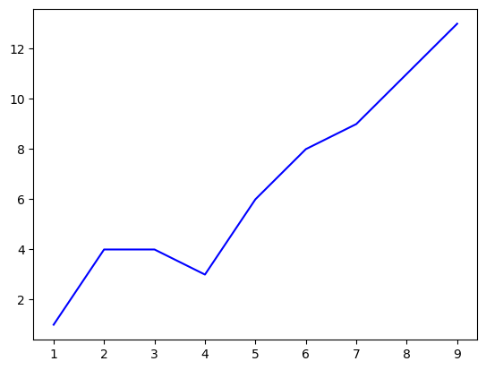
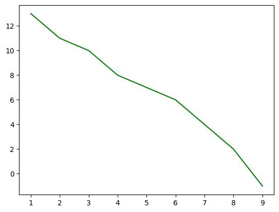

<p class="intro"><span class="dropcap">D</span>ata Visualization can be scary with how many tools, IDEs, coding languages, and platforms that are available, so take a step back, and let's go back to basics and start with one of the most popular coding languages today: PYTHON</p>

### Where to get started: set up
If you're coding in python, you'll really want an interface, but it doesn't need to be anything fancy. You can use an IDE like pycharm, a text-editor like VS code, or a browser-based tool like Google Collab. All three of which have free options: for [Pycharm Community Edition](https://www.jetbrains.com/pycharm/download/?section=mac) scroll down to Community Edition and select the dropdown for your computer type, for [VS Code](https://code.visualstudio.com/) just select the download button, and [Google Colab](https://colab.research.google.com/) is available to anyone with a google account.

Now you'll want to install and import a couple of libraries. For the sake of this tutorial, we're going to use matplotlib.pyplot, and numpy. If it's your first time using these libraries in an IDE, Text Editor, or CLI, you'll need to install them. This is how I install it on my mac or for a Linux:
```
python3 -m pip install "matplotlib"
```
Pretty similar line for a windows:
```
py -m pip install "numpy"
```
Or you can follow this [tutorial](https://packaging.python.org/en/latest/tutorials/installing-packages/) by Python if you get stuck. 

Once the library has been installed (which you'll only need to do once), you'll import the library and shorten the name you use to reference, write these lines of code at the top of your file:
```{python}
import matplotlib.pyplot as plt
import numpy as np
```

Now we're ready to get graphing.

## Plot Production
#### Line Graphs
Line Graphs are a great way to visualize trends in data. They're used for line of best fit, displaying the relationship between simple datasets or two parts of a more complex dataset. The x-axis is typically used to measure the time over which data is measured. Examples of line graphs include: stocks over hours, weight over months, price over season, # of ticket sales per day, etc.

The first part of the code for the line graph is defining our line graph function and looks like this: 
```{python}
def line(x_points, y_points, color):
    plt.plot(x_points, y_points, color = color)
    plt.show()
```
<em>.plot and .show come from the matplotlib library and accessed using our shortcut "plt"</em>

The function by itself doesn't do anything because we need to define the data. You can do that using two lists of the same length:
```{python}
x = [1, 2, 3, 4, 5, 6, 7, 8, 9]
y = [1, 4, 4, 3, 6, 8, 9, 11, 13]
line(x, y, 'b')  
```



Or you can define a matrix/array with numpy:
```{python}
data = np.array([[1, 13], [2, 11], [3, 10],
                 [4, 8], [5, 7], [6, 6], 
                 [7, 4], [8, 2], [9, -1]])
line(data[:, 0], data[:, 1], 'g')
```



### The Rest of the article is Coming Soon